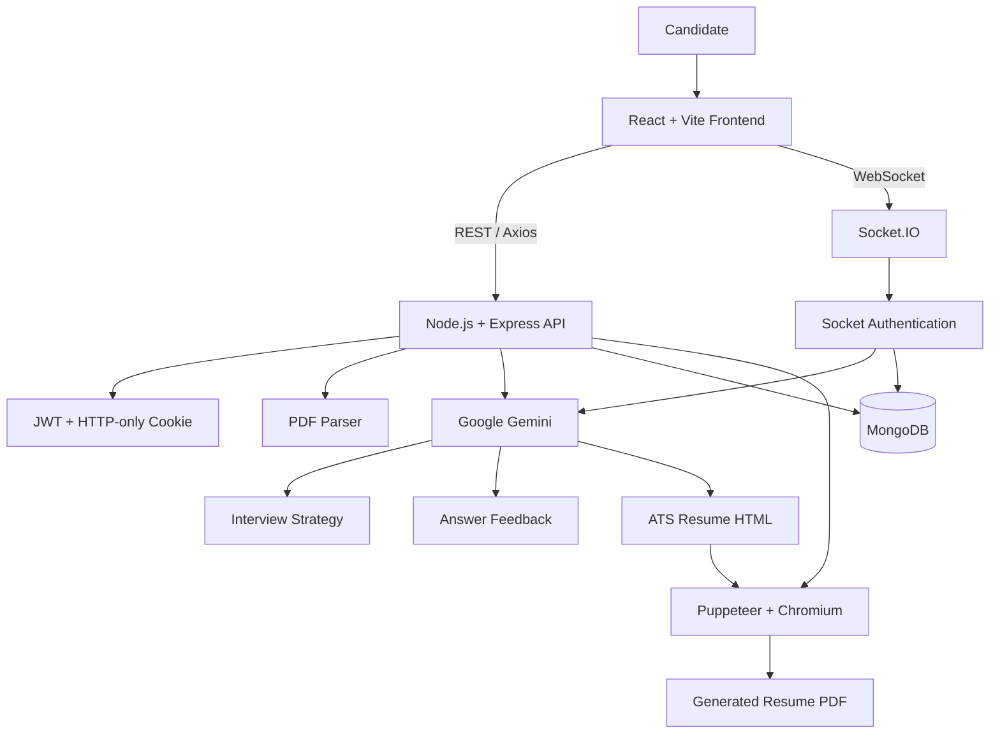

# INTERVIEW-AI 🎤

> An AI-powered interview preparation and live mock-interview platform that turns a candidate's resume and target job description into a personalized interview strategy, preparation roadmap, tailored resume, and real-time answer feedback.

[](https://react.dev/)
[](https://vite.dev/)
[](https://nodejs.org/)
[](https://www.mongodb.com/)
[](https://socket.io/)
[](https://ai.google.dev/)

---

## 🌐 Live Demo

**Live application:** https://interview-ai-prep-zeta.vercel.app/login

> If the deployment URL changes, update this link.

---

## 📌 Table of Contents

- [Overview](#-overview)
- [Why INTERVIEW-AI](#-why-interview-ai)
- [Features](#-features)
- [End-to-End Workflow](#-end-to-end-workflow)
- [AI Capabilities](#-ai-capabilities)
- [System Architecture](#-system-architecture)
- [Tech Stack](#-tech-stack)
- [Project Structure](#-project-structure)
- [Data Model](#-data-model)
- [REST API](#-rest-api)
- [Socket.IO Events](#-socketio-events)
- [Getting Started](#-getting-started)
- [Environment Variables](#-environment-variables)
- [Running Locally](#-running-locally)
- [Deployment](#-deployment)
- [Security](#-security)
- [Error Handling](#-error-handling)
- [Performance and Engineering Decisions](#-performance-and-engineering-decisions)
- [Known Considerations](#-known-considerations)
- [Testing](#-testing)
- [Future Improvements](#-future-improvements)
- [Contributing](#-contributing)
- [License](#-license)

---

## 🧠 Overview

INTERVIEW-AI is a full-stack AI interview-preparation platform designed around a simple idea:

**Interview preparation should be personalized to the candidate and the job, not based on generic question lists.**

A candidate provides:

1. A target **job description**
2. A **PDF resume** and/or self-description

The platform then:

- extracts text from the resume,
- analyzes the candidate against the target role using Google Gemini,
- generates a structured interview strategy,
- calculates a candidate-role match score,
- identifies skill gaps,
- creates technical and behavioral interview questions,
- produces a day-wise preparation roadmap,
- stores the strategy in MongoDB,
- provides a live mock-interview experience,
- evaluates submitted answers in real time,
- generates a tailored ATS-friendly resume as a PDF,
- and delivers real-time in-app notifications.

The application uses **React + Vite** on the frontend and **Node.js + Express + MongoDB** on the backend, with **Socket.IO** for real-time communication.

---

## 🎯 Why INTERVIEW-AI?

Traditional interview preparation often has three problems:

- Generic questions do not reflect the actual job description.
- Candidates do not know which skills they are missing.
- Reading model answers does not provide feedback on the candidate's own responses.

INTERVIEW-AI addresses these gaps by connecting the candidate's:

**Resume + Self Description + Job Description**

to an AI-driven workflow that produces:

**Match Analysis → Questions → Skill Gaps → Roadmap → Live Practice → Feedback → Tailored Resume**

---

## ✨ Features

### 🔐 1. Authentication & Account Management

- User registration
- User login
- Password hashing using `bcryptjs`
- JWT-based authentication
- HTTP-only authentication cookie
- Protected frontend routes
- Protected backend APIs
- Logout support
- JWT blacklist on logout
- Current-user endpoint

### 📄 2. Resume Upload & Parsing

- PDF resume upload
- Multipart form-data support with Multer
- In-memory file processing
- PDF text extraction using `pdf-parse`
- Resume text passed directly into the AI analysis pipeline
- No permanent resume-file storage is required for the interview-generation flow

### 🤖 3. AI-Powered Interview Strategy

Given a resume/self-description and job description, Gemini generates structured data containing:

- Target job title
- Candidate-job match score
- Technical questions
- Behavioral questions
- Skill gaps
- Skill-gap severity
- Day-wise preparation plan

### 📊 4. Interview Reports

Each generated interview strategy is stored in MongoDB and associated with the authenticated user.

Users can:

- View all previous interview strategies
- Open an individual strategy
- Review match score
- Review technical questions
- Review behavioral questions
- Review skill gaps
- Follow the preparation roadmap
- Delete an interview strategy

### 🧪 5. Live Mock Interview

The interview report becomes an interactive practice environment.

Users can:

- Select a technical or behavioral question
- Type an answer
- Submit it for AI evaluation
- Receive live analysis status
- Receive a score out of 100
- See strengths
- See weaknesses
- See missing concepts
- Get actionable improvement suggestions
- See a better/model answer
- Receive a follow-up interview question
- Move to the next question

### ⚡ 6. Real-Time Communication with Socket.IO

Socket.IO is used for real-time events such as:

- Interview generation started
- Interview generation progress
- Interview generation completed
- Interview generation errors
- Answer analysis started
- Answer feedback received
- Answer-analysis errors
- New notifications
- Reconnection handling

### 🔔 7. Real-Time Notifications

The application provides an in-app notification system.

Users can:

- View notifications
- See unread notifications
- Mark one notification as read
- Mark all notifications as read
- Delete notifications

Notifications are persisted in MongoDB and emitted through Socket.IO.

### 📑 8. AI Resume Generator

After an interview strategy is generated, the platform can create a job-tailored resume.

Pipeline:

```text
Interview Report
      ↓
Resume + Self Description + Job Description
      ↓
Google Gemini
      ↓
ATS-friendly HTML
      ↓
Puppeteer / Chromium
      ↓
A4 PDF
```

The generated resume is designed to be:

- Job-tailored
- ATS-friendly
- Concise
- Professional
- Approximately 1–2 pages
- Downloadable directly from the interview report page

### 🎨 9. Responsive Frontend

The frontend includes:

- React Router navigation
- Protected routes
- Context API state management
- Axios API communication
- SCSS styling
- Responsive layouts
- Dedicated authentication pages
- Interview dashboard
- Interview report sections
- Mock interview interface
- Notification dropdown

---

## 🔄 End-to-End Workflow

```text
                    ┌─────────────────────┐
                    │       Candidate     │
                    └──────────┬──────────┘
                               │
                               ▼
                ┌────────────────────────────┐
                │ Login / Register           │
                └──────────────┬─────────────┘
                               │
                               ▼
                ┌────────────────────────────┐
                │ Job Description             │
                │ Resume PDF / Self-Desc     │
                └──────────────┬─────────────┘
                               │
                               ▼
                ┌────────────────────────────┐
                │ PDF Text Extraction        │
                │ pdf-parse + Multer         │
                └──────────────┬─────────────┘
                               │
                               ▼
                ┌────────────────────────────┐
                │ Google Gemini               │
                │ Structured AI Analysis      │
                └──────────────┬─────────────┘
                               │
               ┌───────────────┼────────────────┐
               ▼               ▼                ▼
        Match Score       Skill Gaps       Questions
               │               │                │
               └───────────────┼────────────────┘
                               ▼
                ┌────────────────────────────┐
                │ Preparation Roadmap        │
                └──────────────┬─────────────┘
                               │
                               ▼
                ┌────────────────────────────┐
                │ MongoDB Interview Report   │
                └──────────────┬─────────────┘
                               │
               ┌───────────────┼────────────────┐
               ▼               ▼                ▼
          Mock Interview   Question Bank   Resume PDF
               │
               ▼
        Socket.IO Answer Submit
               │
               ▼
          Gemini Evaluation
               │
               ▼
        Score + Feedback +
        Better Answer +
        Follow-up Question
```

---

## 🏗️ System Architecture



### Main request flow

**Frontend → Express → Controller → Service → MongoDB / Gemini → Frontend**

### Real-time flow

**Frontend Socket.IO Client → Authenticated Socket.IO Server → Gemini → MongoDB → Socket Event → Frontend**

---

## 🧰 Tech Stack

### Frontend

| Technology | Purpose |
|---|---|
| React 19 | UI development |
| Vite | Development server and production build |
| React Router | Client-side routing |
| Axios | REST API communication |
| Socket.IO Client | Real-time communication |
| SCSS | Styling |
| Context API | Authentication/interview state |

### Backend

| Technology | Purpose |
|---|---|
| Node.js | Runtime |
| Express 5 | REST API |
| MongoDB | Persistent storage |
| Mongoose | MongoDB ODM |
| JWT | Authentication |
| bcryptjs | Password hashing |
| Cookie Parser | Cookie handling |
| CORS | Cross-origin requests |
| Multer | Multipart file upload |
| pdf-parse | Resume PDF text extraction |
| Socket.IO | Real-time communication |
| Zod | AI response schema validation |
| zod-to-json-schema | Gemini structured output schema |
| dotenv | Environment configuration |

### AI & Document Generation

| Technology | Purpose |
|---|---|
| Google Gemini | Interview analysis, answer evaluation, resume generation |
| Puppeteer | HTML → PDF rendering |
| Chromium | PDF generation runtime |
| `@sparticuz/chromium` | Serverless Chromium support |

---

## 📁 Project Structure

```text
INTERVIEW-AI/
│
├── Backend/
│   ├── api/
│   │   └── index.js
│   │
│   ├── src/
│   │   ├── config/
│   │   │   └── database.js
│   │   │
│   │   ├── controllers/
│   │   │   ├── auth.controller.js
│   │   │   ├── interview.controller.js
│   │   │   └── notification.controller.js
│   │   │
│   │   ├── middlewares/
│   │   │   ├── auth.middleware.js
│   │   │   └── file.middleware.js
│   │   │
│   │   ├── models/
│   │   │   ├── answerFeedback.model.js
│   │   │   ├── blacklist.model.js
│   │   │   ├── interviewReport.model.js
│   │   │   ├── notification.model.js
│   │   │   └── user.model.js
│   │   │
│   │   ├── routes/
│   │   │   ├── auth.routes.js
│   │   │   ├── interview.routes.js
│   │   │   └── notification.routes.js
│   │   │
│   │   ├── services/
│   │   │   ├── ai.service.js
│   │   │   └── notification.service.js
│   │   │
│   │   ├── socket/
│   │   │   ├── interviewHandler.js
│   │   │   └── socket.js
│   │   │
│   │   └── app.js
│   │
│   ├── server.js
│   ├── Dockerfile
│   ├── vercel.json
│   ├── nixpacks.toml
│   └── package.json
│
├── Frontend/
│   ├── public/
│   ├── src/
│   │   ├── components/
│   │   ├── features/
│   │   │   ├── auth/
│   │   │   ├── interview/
│   │   │   └── notifications/
│   │   ├── services/
│   │   │   └── socket.service.js
│   │   ├── App.jsx
│   │   ├── app.routes.jsx
│   │   ├── main.jsx
│   │   └── style.scss
│   │
│   ├── index.html
│   ├── vite.config.js
│   ├── vercel.json
│   └── package.json
│
├── Dockerfile
├── vercel.json
├── nixpacks.toml
├── package.json
└── README.md
```

---

## 🗄️ Data Model

### User

```text
User
├── username
├── email
└── password (hashed)
```

### InterviewReport

```text
InterviewReport
├── user
├── title
├── jobDescription
├── resume
├── selfDescription
├── matchScore
├── technicalQuestions[]
│   ├── question
│   ├── intention
│   └── answer
├── behavioralQuestions[]
│   ├── question
│   ├── intention
│   └── answer
├── skillGaps[]
│   ├── skill
│   └── severity
└── preparationPlan[]
    ├── day
    ├── focus
    └── tasks[]
```

### AnswerFeedback

```text
AnswerFeedback
├── interviewId
├── userId
├── question
├── userAnswer
├── score
├── strengths[]
├── weaknesses[]
├── missingPoints[]
├── suggestions[]
├── betterAnswer
└── followUpQuestion
```

### Notification

```text
Notification
├── userId
├── type
├── title
├── message
└── read
```

### Blacklisted Token

```text
BlacklistToken
└── token
```

---

# 🔌 REST API

All API routes are prefixed with `/api`.

Authentication uses the `token` HTTP-only cookie.

## Authentication

### Register

```http
POST /api/auth/register
```

Request:

```json
{
  "username": "candidate",
  "email": "candidate@example.com",
  "password": "your-password"
}
```

### Login

```http
POST /api/auth/login
```

Request:

```json
{
  "email": "candidate@example.com",
  "password": "your-password"
}
```

### Get Current User

```http
GET /api/auth/get-me
```

**Authentication:** Required

### Logout

```http
GET /api/auth/logout
```

---

## Interview APIs

### Generate Interview Strategy

```http
POST /api/interview/
```

**Authentication:** Required

Content type:

```text
multipart/form-data
```

Fields:

| Field | Type | Required |
|---|---|---|
| `jobDescription` | string | Yes |
| `selfDescription` | string | Either this or resume |
| `resume` | PDF file | Either this or selfDescription |
| `generationId` | string | Optional |

The backend:

1. Validates authentication.
2. Extracts PDF text if a resume is uploaded.
3. Sends candidate data and job description to Gemini.
4. Receives structured JSON.
5. Stores the interview report.
6. Emits progress/completion events when `generationId` is provided.
7. Creates a completion notification.

### Get All Interview Reports

```http
GET /api/interview/
```

**Authentication:** Required

### Get One Interview Report

```http
GET /api/interview/report/:interviewId
```

**Authentication:** Required

### Delete Interview Report

```http
DELETE /api/interview/:interviewId
```

**Authentication:** Required

### Generate Tailored Resume PDF

```http
POST /api/interview/resume/pdf/:interviewReportId
```

**Authentication:** Required

Returns:

```text
application/pdf
```

---

## Notification APIs

### Get Notifications

```http
GET /api/notifications
```

### Mark Notification as Read

```http
PATCH /api/notifications/:id/read
```

### Mark All Notifications as Read

```http
PATCH /api/notifications/read-all
```

### Delete Notification

```http
DELETE /api/notifications/:id
```

All notification endpoints require authentication.

---

## Health Check

```http
GET /api/health
```

Example response:

```json
{
  "status": "OK",
  "message": "Server is healthy",
  "timestamp": "2026-08-25T00:00:00.000Z"
}
```

---

# ⚡ Socket.IO Events

The application uses authenticated Socket.IO connections for real-time interview processing.

## Connection

The frontend connects using:

```text
VITE_SOCKET_URL
```

or falls back to:

```text
VITE_API_BASE_URL
```

If the URL ends with `/api`, the client removes `/api` before establishing the Socket.IO connection.

---

## Interview Generation Events

### `interview:started`

Emitted when interview generation begins.

```json
{
  "generationId": "generation-id",
  "message": "Starting interview analysis..."
}
```

### `interview:progress`

Used to display generation progress.

Example stages:

```text
resume_parsing
ai_processing
saving_strategy
completed
```

Example:

```json
{
  "generationId": "generation-id",
  "stage": "ai_processing",
  "progress": 50,
  "message": "AI is processing your interview strategy..."
}
```

### `interview:completed`

Contains the generated interview report.

### `interview:error`

Contains an error message associated with the generation ID.

---

## Mock Interview Events

### Client → Server

```text
answer:submit
```

Payload:

```json
{
  "interviewId": "report-id",
  "question": "Explain REST APIs.",
  "answer": "My answer...",
  "resume": "Resume text...",
  "jobDescription": "Job description..."
}
```

### Server → Client

```text
answer:analyzing
answer:feedback
answer:error
```

The feedback contains:

- Score
- Strengths
- Weaknesses
- Missing concepts
- Suggestions
- Better answer
- Follow-up question

---

## Notification Event

### `notification:new`

Sent to the authenticated user's Socket.IO room whenever a new notification is created.

User-specific rooms follow:

```text
user:<userId>
```

---

# 🧩 AI Architecture

The AI service is intentionally separated from controllers.

```text
Controller
   ↓
AI Service
   ↓
Gemini
   ↓
Structured JSON
   ↓
Controller
   ↓
MongoDB
```

## Interview Report Generation

The interview-generation schema is defined using Zod and converted to JSON Schema using `zod-to-json-schema`.

This reduces the risk of receiving unpredictable free-form AI output.

Conceptually:

```text
Zod Schema
    ↓
JSON Schema
    ↓
Gemini structured response
    ↓
JSON.parse()
    ↓
MongoDB
```

The generated strategy contains:

```text
title
matchScore
technicalQuestions
behavioralQuestions
skillGaps
preparationPlan
```

## Answer Evaluation

Each mock-interview answer is evaluated against:

1. Relevance
2. Technical correctness
3. Clarity and communication
4. Completeness
5. Edge cases / trade-offs where applicable

The AI returns structured feedback instead of a single paragraph.

---

# 🛠️ Getting Started

## Prerequisites

Install:

- Node.js 18+
- npm
- MongoDB
- Google Gemini API key
- Chromium/Chrome for local PDF generation, if Puppeteer cannot locate one automatically

Recommended Node.js version:

```text
Node.js 20+
```

---

## 1. Clone the Repository

```bash
git clone <your-repository-url>
cd INTERVIEW-AI
```

---

## 2. Install Backend Dependencies

```bash
cd Backend
npm install
```

---

## 3. Install Frontend Dependencies

Open another terminal:

```bash
cd Frontend
npm install
```

---

# 🔑 Environment Variables

## Backend

Create:

```text
Backend/.env
```

Recommended configuration:

```env
PORT=5000

MONGO_URI=mongodb+srv://<username>:<password>@<cluster>/<database>

JWT_SECRET=replace-with-a-long-random-secret

GEMINI_API_KEY=your-gemini-api-key

CORS_ORIGIN=http://localhost:5173

FRONTEND_URL=http://localhost:5173

NODE_ENV=development
```

### Variable reference

| Variable | Purpose |
|---|---|
| `PORT` | Backend HTTP port |
| `MONGO_URI` | MongoDB connection string |
| `JWT_SECRET` | Secret used to sign/verify JWTs |
| `GEMINI_API_KEY` | Google Gemini API credential |
| `CORS_ORIGIN` | Allowed frontend origin |
| `FRONTEND_URL` | Frontend URL used by deployment configuration |
| `NODE_ENV` | Runtime environment |

> Never commit `.env` files or API keys to Git.

---

## Frontend

Create:

```text
Frontend/.env
```

Example:

```env
VITE_API_BASE_URL=http://localhost:5000
VITE_SOCKET_URL=http://localhost:5000
```

For production, replace these with the deployed backend URL.

Example:

```env
VITE_API_BASE_URL=https://your-backend.example.com
VITE_SOCKET_URL=https://your-backend.example.com
```

> Vite exposes variables beginning with `VITE_` to the browser. Do not put secrets in frontend environment variables.

---

# ▶️ Running Locally

## Start Backend

```bash
cd Backend
npm run dev
```

Backend:

```text
http://localhost:5000
```

Health check:

```text
http://localhost:5000/api/health
```

## Start Frontend

In another terminal:

```bash
cd Frontend
npm run dev
```

Frontend:

```text
http://localhost:5173
```

---

# 🏭 Production Build

## Frontend

```bash
cd Frontend
npm run build
```

Preview:

```bash
npm run preview
```

## Backend

```bash
cd Backend
npm start
```

---

# 🐳 Docker

The repository includes Docker configuration for the backend.

The Docker image installs Chromium because the application uses Puppeteer to generate PDF resumes.

Build:

```bash
docker build -t interview-ai .
```

Run:

```bash
docker run -p 5000:5000 --env-file Backend/.env interview-ai
```

The container configures:

```text
PUPPETEER_SKIP_CHROMIUM_DOWNLOAD=true
PUPPETEER_EXECUTABLE_PATH=/usr/bin/chromium
```

This avoids downloading another Chromium copy during npm installation.

---

# ☁️ Deployment

A practical production architecture is:

```text
                         ┌──────────────────┐
                         │   Vercel         │
                         │   React Frontend │
                         └────────┬─────────┘
                                  │
                           HTTPS / REST
                                  │
                                  ▼
                         ┌──────────────────┐
                         │ Long-running     │
                         │ Node Backend     │
                         │ Railway/Render   │
                         └───────┬──────────┘
                                 │
                   ┌─────────────┼──────────────┐
                   ▼             ▼              ▼
              MongoDB       Gemini API      Socket.IO
```

## Frontend deployment

The `Frontend/vercel.json` file contains the SPA rewrite needed for client-side routing.

Configure:

```env
VITE_API_BASE_URL=https://your-backend-domain
VITE_SOCKET_URL=https://your-backend-domain
```

## Backend deployment

The backend can be deployed as a Node.js service or Docker container.

Required production environment variables include:

```env
MONGO_URI=...
JWT_SECRET=...
GEMINI_API_KEY=...
CORS_ORIGIN=https://your-frontend-domain
FRONTEND_URL=https://your-frontend-domain
NODE_ENV=production
```

For Docker deployments, Chromium is installed by the included Dockerfile.

---

# 🔒 Security

The project includes several security mechanisms:

### Password Security

Passwords are hashed using:

```text
bcryptjs
```

Passwords are never intentionally returned in authentication responses.

### JWT Authentication

JWTs contain authenticated user information and expire after one day.

### HTTP-only Cookie

The authentication token is stored in an HTTP-only cookie rather than browser local storage.

### Production Cookie Settings

Production authentication cookies use:

```text
secure: true
sameSite: none
```

### Token Blacklisting

On logout:

```text
JWT
 ↓
Blacklist collection
 ↓
Cookie cleared
```

Future requests using the blacklisted token are rejected.

### Protected Resources

Interview reports are queried using both:

```text
interviewId
+
authenticated user ID
```

This prevents a user from retrieving another user's interview report through the normal report endpoint.

---

# ⚠️ Security Recommendations Before Public Production Use

For a production-grade release, consider adding:

- Rate limiting for authentication and AI endpoints
- Stronger password policy
- Request body size limits
- File size/type validation with stricter limits
- PDF malware/content scanning
- Input sanitization
- CSRF protection strategy for cookie-based authentication
- Token blacklist expiration/cleanup
- Database indexes for frequent queries
- API request logging and audit logging
- Centralized error handling
- Secrets management through the deployment platform
- AI request quotas and abuse prevention
- Content moderation / prompt-injection defenses for uploaded resumes and job descriptions

---

# 🚨 Error Handling

The backend returns structured HTTP responses for common failure cases.

Examples:

### Missing authentication

```http
401 Unauthorized
```

### Missing job description

```http
400 Bad Request
```

### Missing resume and self-description

```http
400 Bad Request
```

### Missing interview report

```http
404 Not Found
```

### Server/AI/database failure

```http
500 Internal Server Error
```

The Socket.IO layer also emits dedicated error events so the frontend can display real-time failures without requiring a page refresh.

---

# ⚙️ Performance & Engineering Decisions

## 1. Structured AI Output

Instead of relying on free-form AI text, the application uses:

```text
Zod → JSON Schema → Gemini structured response
```

This makes downstream processing more predictable.

## 2. In-Memory Resume Processing

Uploaded resumes are processed directly from memory.

Benefits:

- No unnecessary temporary file storage
- Simpler request lifecycle
- Lower storage overhead

Trade-off:

- Large uploads can increase memory usage, so production deployments should enforce strict file-size limits.

## 3. Real-Time Progress

Interview generation can involve several stages:

```text
Resume Parsing
      ↓
AI Processing
      ↓
Saving Strategy
      ↓
Completed
```

Socket.IO lets the UI display progress instead of making the user wait on a static loading screen.

## 4. Separation of Concerns

The backend separates:

```text
Routes
Controllers
Services
Models
Middleware
Socket Handlers
```

For example:

- Routes define endpoints.
- Controllers handle HTTP request/response logic.
- AI service owns Gemini interaction.
- Models own MongoDB schemas.
- Socket layer owns real-time communication.
- Middleware owns authentication and file processing.

## 5. Serverless-Aware PDF Generation

The resume generator detects serverless environments and can use:

```text
puppeteer-core
+
@sparticuz/chromium
```

while local/Docker environments can use:

```text
puppeteer
+
system Chromium
```

---

# 🧪 Testing

The backend currently does not include a configured automated test suite.

The package currently contains a placeholder test command.

A production-ready testing strategy should include:

### Unit Tests

- Authentication controller
- AI service validation
- Notification service
- Interview report creation
- Socket handlers

### Integration Tests

- Register/login/logout flow
- Protected endpoints
- Interview generation API
- Report retrieval
- Report deletion
- Notification endpoints

### Frontend Tests

- Login/register forms
- Protected routes
- Interview report rendering
- Mock interview submission
- Feedback rendering
- Notification interactions

### End-to-End Tests

Recommended flow:

```text
Register
  ↓
Login
  ↓
Create Interview Strategy
  ↓
View Report
  ↓
Start Mock Interview
  ↓
Submit Answer
  ↓
Receive AI Feedback
  ↓
Generate Resume PDF
  ↓
Logout
```

---

# 🧭 Known Considerations

### 1. Gemini Model Availability

The project currently references:

```text
gemini-3-flash-preview
```

Because preview models can change availability, limits, or behavior, production deployments should verify model availability and quotas.

### 2. Socket.IO Hosting

The backend uses a long-lived HTTP server for Socket.IO.

If deploying the backend to a serverless platform, verify that persistent WebSocket/Socket.IO behavior is supported by the chosen deployment architecture. For reliable real-time functionality, a long-running Node.js service is generally the safer architecture.

### 3. PDF Generation

Chromium is required for the resume generator.

Docker/Nixpacks configuration is included to support Chromium-based PDF generation.

### 4. AI Cost and Rate Limits

Interview reports, answer evaluations, and resume generation all invoke the AI service.

Production deployments should consider:

- request limits,
- user quotas,
- caching,
- retry policies,
- usage monitoring,
- and cost controls.

### 5. Uploaded Content Is Untrusted Input

Resume and job-description text is user-controlled input. A production version should explicitly defend against prompt injection and excessively large/malicious content.

---

# 🗺️ Future Improvements

Potential next versions could include:

- [ ] Voice-based mock interviews
- [ ] Speech-to-text answer input
- [ ] AI evaluation of communication style
- [ ] Filler-word detection
- [ ] Confidence and speaking-speed analysis
- [ ] Interview session history
- [ ] Overall interview score
- [ ] Progress analytics over time
- [ ] Company-specific interview modes
- [ ] Coding interview mode
- [ ] System-design interview mode
- [ ] Role-specific question banks
- [ ] Difficulty selection
- [ ] Follow-up question chains
- [ ] Interview timer
- [ ] AI interviewer personas
- [ ] Resume version history
- [ ] ATS keyword analysis
- [ ] Job-description keyword extraction
- [ ] Job application tracker
- [ ] Email/job-alert integration
- [ ] Redis-based caching and rate limiting
- [ ] Background job queue for long-running AI tasks
- [ ] Automated test coverage
- [ ] CI/CD pipeline
- [ ] Observability and structured logging

---

# 💡 Example Use Case

Suppose a candidate applies for:

```text
Software Development Engineer Intern
```

They upload their resume and paste the job description.

INTERVIEW-AI can transform that input into:

```text
Target Role
    ↓
SDE Intern

Match Score
    ↓
87%

Technical Questions
    ↓
React, APIs, Node.js, SQL, DSA...

Behavioral Questions
    ↓
Teamwork, conflict, ownership...

Skill Gaps
    ↓
System Design → Medium
Advanced DSA → High
Testing → Low

Preparation Plan
    ↓
Day 1 → DSA
Day 2 → Backend
Day 3 → SQL
Day 4 → React
...

Live Mock Interview
    ↓
Candidate Answer
    ↓
AI Score: 78/100
    ↓
Strengths
Weaknesses
Missing Concepts
Better Answer
Follow-up Question

Tailored Resume
    ↓
ATS-friendly PDF
```

This makes the application useful as an end-to-end interview preparation workflow rather than just an AI question generator.

---

# 🏆 What This Project Demonstrates

INTERVIEW-AI demonstrates practical full-stack engineering across several areas:

- Full-stack application architecture
- REST API design
- Authentication and authorization
- JWT and HTTP-only cookies
- MongoDB data modeling
- File upload and PDF parsing
- Generative AI integration
- Structured AI responses
- Prompt engineering
- Real-time communication with Socket.IO
- Event-driven UI updates
- AI answer evaluation
- Dynamic PDF generation
- Chromium/Puppeteer deployment
- Docker-based backend deployment
- CORS and cross-origin authentication
- React state management
- Responsive UI development
- Serverless-aware engineering

---

# 🤝 Contributing

Contributions are welcome.

### 1. Fork the repository

```bash
git fork <repository-url>
```

### 2. Create a feature branch

```bash
git checkout -b feature/your-feature
```

### 3. Make your changes

Follow the existing project structure and naming conventions.

### 4. Commit

```bash
git commit -m "feat: add your feature"
```

### 5. Push

```bash
git push origin feature/your-feature
```

### 6. Open a Pull Request

Please describe:

- What changed
- Why it was needed
- How it was tested
- Any deployment/environment changes

---

# 📄 License

No explicit open-source license is currently included in the repository.

If you plan to make the project publicly reusable, add an appropriate license file such as MIT before presenting the repository as an open-source project.

---

## ⭐ If You Find This Project Useful

Consider starring the repository and sharing feedback.

Built with ❤️ using React, Node.js, MongoDB, Socket.IO, and Google Gemini.
